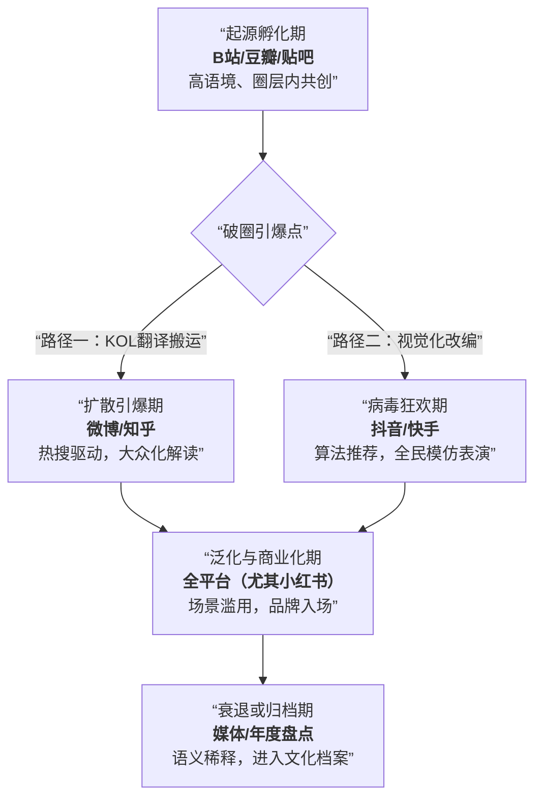

好的，作为一名专业的商业分析师和内容创作者，我将基于您提供的详尽分析素材，整合并深化洞察，为您呈现一份结构完整、逻辑清晰、见解深刻的《2025年网络热梗深度分析报告》。

***

# 2025年网络热梗深度分析报告：情绪、身份与商业化的赛博语法

## # 执行摘要 (Executive Summary)

### **核心发现**
本报告通过对2025年度中文互联网十大代表性热梗的溯源、传播与影响分析，揭示出当前网络梗文化已演变为一套精密的“赛博生存语法”。其核心驱动力不再是单纯的娱乐，而是当代网民（尤其是Z世代）应对社会压力、进行身份协商与寻求情感共鸣的集体心理机制。热梗呈现出 **“生命周期极速缩短”** 与 **“情绪价值高度集中”** 两大特征，其生产、传播与消亡的全过程，被各大社交平台的生态逻辑深度塑造。

### **关键趋势**
1.  **情绪刚需化**：热梗首要功能是作为“情绪出口”和“赛博嘴替”，服务于自嘲、共情、解压与温和抵抗等心理需求。
2.  **生产矩阵化**：单一梗生命周期缩短，但以“门派”（如方言派、发疯派、谐音派）形式集群出现，形成梗矩阵，共享同一文化逻辑。
3.  **传播平台化**：梗的形态与路径被平台特性严格定义：B站是“文化作坊”，抖音是“病毒工厂”，微博是“舆论广场”，小红书是“生活指南”。
4.  **商业适配分化**：梗的商业价值取决于其情感基调与可塑性。“高雅人士”、“蒜了”等普适幽默型梗价值最高；“俺不中嘞”等圈层共鸣型需谨慎使用；涉及敏感议题的梗则风险极高。

## # 2025年热门梗Top10深度解析

以下选取年度最具代表性的十个梗，解析其从“起因”到“经过”再到“结果”的完整文化生命周期。

| 排名 | 梗名称 | 核心内涵 | 社会心理动因 | 生命周期阶段（截至2025年末） |
| :--- | :--- | :--- | :--- | :--- |
| **1** | **高雅人士** | 对故作深沉、以文化品位标榜优越感行为的戏谑反讽。 | 对“文化区隔”与“审美霸权”的反感，大众对真诚、接地气表达的渴望。 | **泛化期**：已从特定领域泛化为通用社交标签，使用频繁，原创性减弱。 |
| **2** | **俺不中嘞！** | 一句魔性的河南方言，表达“顶不住了”、“我拒绝”的崩溃感。 | 为高压生活下的瞬间崩溃提供生动、直接的“赛博嘴替”，方言趣味性加成。 | **巅峰期**：通过短视频平台病毒式模仿达到顶峰，成为全民情绪表达工具。 |
| **3** | **连滚带爬** | 形容手忙脚乱、狼狈不堪但仍奋力向前的状态。 | 对现代快节奏、多任务生存状态的幽默自嘲，引发广泛职场与生活共鸣。 | **扩散期**：从名人微博起源，迅速渗透至职场、校园等具体场景，完成场景化绑定。 |
| **4** | **蒜（算了）** | “算了”的谐音，但语气更柔和，蕴含无奈、妥协与豁达。 | 提供低阻力、高情商的情绪表达方案，符合网络沟通的经济学原则。 | **稳定期**：已融入日常网络用语，成为输入法文化下的稳定词汇。 |
| **5** | **谁懂？/来都来了** | 寻求小众共鸣的呼喊与对沉没成本效应的幽默承认。 | 反映圈层化社交中寻找同好的渴望，以及面对既定投入的“破罐破摔”式幽默。 | **圈层固化期**：作为固定句式，在特定社群内保持活力，成为内部身份暗号。 |
| **6** | **职场发疯文学** | 用荒诞、文学化的方式创造性吐槽职场日常。 | “创造性抵抗”的体现，将无力感转化为有形式的创作，是炫耀性摆烂的高级形式。 | **创新期**：在小红书、知乎等平台持续涌现新作品，依赖个体创意驱动。 |
| **7** | **赛博嘴替** | 能精准代偿个人复杂情绪的网络梗、评论或博主。 | 社交谨慎时代的安全情绪出口，实现“借他人之口，抒自己之怀”，快速建立认同。 | **概念期**：本身作为元概念存在，用于总结和归类其他热梗现象，生命力持久。 |
| **8** | **魔性热梗四大门派** | 对年度热梗生成模式（如方言、谐音、发疯、复古）的归纳框架。 | 满足网民对玩梗行为的“元认知”乐趣，以及对文化现象进行秩序化归纳的偏好。 | **理论传播期**：由媒体/KOL提出后，引发全民对号入座与二次验证，成为分析工具。 |
| **9** | **电子木鱼/赛博功德** | 通过形式化的数字行为寻求内心安宁，对抗信息焦虑。 | 面对社会负面事件的代偿性疗愈，科技与传统的反差幽默。 | **演化期**：从具体App行为演化为一种普遍心态，应用场景不断迁移和扩展。 |
| **10**| **具体问题具体分析（摆烂版）**| 对严肃方法论的戏仿，表达“懒得思考、随缘”的摆烂心态。 | 解构权威话语，用以应对现实复杂性，是一种温和的抵抗与自我保护。 | **应用期**：在聊天对话、论坛回复中作为“神回复”模板广泛应用，实用性高。 |

**深度解析示例：以“高雅人士”与“俺不中嘞！”为例**
*   **“高雅人士”**的走红，标志着互联网反讽文化从针对具体对象（如“凡尔赛”）转向针对一种**行为模式**和**话语体系**。它起源于B站、豆瓣等文化社区用户对“装腔”行为的敏锐捕捉，经过表情包、吐槽视频的加工，迅速成为一把“万能解构钥匙”。其结果是，任何试图建立文化优越感的言行都可能被此梗消解，迫使网络表达趋向于更真实、更松弛。
*   **“俺不中嘞！”**的爆发，则体现了**地域文化在情绪表达上的强大感染力**。它起源于一个可能偶然的方言视频，在抖音的算法推荐和“拍同款”机制下，被海量用户用于演绎各种“破防”场景。其成功在于将抽象的“压力”和“拒绝”转化为一个极具画面感和声音记忆点的具体动作，实现了情绪的“可视化”传播。最终，它超越了地域限制，成为全网通用的情绪爆发符号。

## # 平台生态全景对比

网络热梗的孕育、成形与爆发，与各大社交平台的底层逻辑密不可分。平台不仅是传播渠道，更是定义梗形态的“产房”。

| 维度 | **微博** | **B站** | **抖音** | **小红书** |
| :--- | :--- | :--- | :--- | :--- |
| **核心生态角色** | **舆论广场与热点引擎** | **文化作坊与圈层圣地** | **病毒舞台与快时尚工厂** | **生活杂志与身份展台** |
| **梗的主要来源** | 社会新闻、娱乐八卦、明星动态、大V发言 | UP主原创视频、番剧动画、游戏直播、弹幕互动 | 热门BGM/特效、达人挑战、情景剧表演、用户模仿 | 博主生活分享、消费体验、情感观点、颜值展示 |
| **梗的典型形态** | **文本梗、话题标签** （如#连滚带爬#） | **弹幕梗、黑话、鬼畜素材** （如“优雅”空耳） | **视听表演梗、挑战赛** （如“俺不中嘞”合拍） | **生活标签梗、金句文案** （如“命运的齿轮”） |
| **用户参与方式** | 转发、评论、在热搜话题下玩梗 | 发弹幕、评论、二次创作（鬼畜/解析） | 拍同款、用同款BGM/特效、参与挑战 | 点赞、收藏、评论共鸣、在笔记中引用标签 |
| **传播路径特点** | 中心化引爆，依赖热搜与大V节点，扩散速度快但衰减也快。 | 社区内深度发酵，通过共创形成文化共识，梗的生命力长尾效应明显。 | 去中心化病毒传播，算法推荐驱动，能在极短时间内形成全民模仿浪潮。 | 圈层化渗透，通过“标记我的生活”形成场景绑定，梗成为生活方式标识。 |
| **对梗文化的核心贡献** | **提供议题，设定公共讨论议程**。将小众情绪上升为公共话题。 | **负责深加工与文化赋义**。赋予梗更丰富的内涵和仪式感。 | **实现最大规模的病毒化复制与表演**。让梗“动起来”，成为身体语言。 | **完成梗的生活化落地与身份化应用**。将梗转化为可实践的消费与生活态度。 |

**生态联动全景**：一个全网爆梗的典型生命周期如下：在**B站/小众社群**完成创意孵化和初期圈层认同；被**微博**大V或营销号捕捉，登上热搜完成“破圈”认证；在**抖音**上通过海量模仿实现病毒式传播与形态简化；最终在**小红书**上被总结为生活方式标签，并反馈到消费领域。微信则作为私域流量池，完成梗在熟人社交中的渗透与沉淀。

## # 跨平台传播机制解密

### **传播路径图谱**
一个梗实现跨平台爆火，通常遵循“孵化→破圈→狂欢→归档”的四阶段路径，各平台在其中扮演接力角色：

### **关键节点分析**
1.  **翻译型KOL（微博/知乎）**：他们是梗从亚文化圈走向大众的关键桥梁。其作用并非简单搬运，而是进行“文化翻译”——剥离原始复杂语境，提炼出普世的情感内核和简易的使用模板，降低大众的理解和参与门槛。
2.  **算法推荐系统（抖音）**：这是梗实现指数级传播的引擎。一旦某个梗的表演形式（如一个动作、一段BGM）被验证具有高互动率，算法会将其推送给更广泛的相似用户，激发“拍同款”的连锁反应，形成无可阻挡的模仿浪潮。
3.  **社群“梗领袖”（B站/小红书）**：在起源和深化阶段，社群中具有创造力和号召力的核心用户（如头部UP主、资深组员）是梗的“定义者”。他们通过高质量的二创或精准的总结，为梗设定最初的“使用规范”和情感基调。
4.  **主流媒体与商业机构**：它们的入场是梗达到社会影响力顶峰的标志，也是其走向衰落的开始。媒体的盘点（如“年度十大热梗”）为梗盖棺定论，商业广告的滥用则加速消耗其新鲜感与原创性，最终导致梗的语义稀释和圈层原住民的逃离。

## # 未来趋势预测

基于2025年的分析，我们对梗文化的未来发展方向做出以下预测：

1.  **AI介入梗的生产与传播**：生成式AI将不仅用于总结梗，更将直接参与造梗。AI可以批量生成谐音梗、创造虚拟人物并赋予其“梗人格”，甚至根据实时热点自动生成段子和表情包，进一步加速梗的生产和迭代速度。
2.  **情绪颗粒度进一步细化**：梗将朝着更精准地捕捉和表达微妙情绪的方向发展。例如，区分“周一早上的疲惫”与“周日晚上焦虑”的专属梗会出现。梗词典将日益庞大，成为赛博时代的情感细分标签。
3.  **虚实融合与“梗AR”化**：随着AR/VR技术普及，梗将不再局限于文字和视频。通过AR滤镜，用户可以将“俺不中嘞！”的虚拟形象直接叠加在现实场景中表演并分享，实现梗的“增强现实化”传播。
4.  **“反梗”文化的兴起**：当玩梗过度成为新的社交压力时，“反梗”或“梗厌恶”情绪将催生新的亚文化。人们会创造新的表达方式来刻意避免使用流行梗，以彰显个性或追求更深刻的交流，形成文化上的辩证循环。
5.  **全球化与在地化交织加剧**：源自海外平台（如TikTok）的梗将更快地传入国内并本土化改造；同时，像“俺不中嘞”这样具有强烈地域特色的中文梗，也可能通过短视频平台反向输出，在全球华人社群甚至好奇的外国用户中传播。

## # 商业化与实用建议

### **对品牌方的建议**
1.  **精准选梗，对号入座**：
    *   **首选“普适幽默型”**：如“高雅人士”、“蒜了”。品牌可扮演“幽默解构者”，用来自嘲或展现亲民形象，安全且易出彩。
    *   **慎用“圈层共鸣型”**：如“连滚带爬”、“俺不中嘞”。使用时必须站在“共情者”和“解决方案提供者”的立场，传递温暖与支持，避免消费苦难。
    *   **禁用“风险禁忌型”**：坚决远离一切与政治、灾难、社会敏感矛盾相关的梗，风险无限大。
2.  **深度融合，而非简单粘贴**：将梗与产品功能、品牌故事深度结合。例如，一个办公软件品牌可以围绕“连滚带爬”创作一系列“从容应对”的功能演示短片，而非仅仅在海报上加一句口号。
3.  **拥抱UGC，激发共创**：发起以梗为主题的轻量级用户共创活动。提供模板和素材，鼓励用户用品牌产品创作自己的“发疯文学”或“高雅人士”瞬间，让用户成为品牌梗传播的节点。
4.  **建立“梗风险”快速评估机制**：市场团队中应有专人负责追踪网络文化动态，并对拟采用的梗进行快速背景审查和风险评级，确保营销动作既敏捷又安全。

### **对内容创作者的建议**
1.  **把握“黄金24小时”**：在梗完成破圈、尚未烂大街的极短时间内，进行快速反应创作，能获得最大流量红利。
2.  **进行“深度二创”或“元解读”**：在全民模仿阶段，另辟蹊径。可以对梗进行深度考据、文化解读（如分析“方言梗”背后的地域文化），或创作“关于玩梗的梗”（元内容），满足受众更深层的认知需求。
3.  **构建个人“梗风格”**：与其追逐每一个热梗，不如将自己擅长创作的风格（如鬼畜、情感解读、情景剧）与合适的梗类型结合，形成独特的“梗人格”，建立辨识度。
4.  **跨平台差异化运营**：了解各平台对梗的偏好。在B站做深度解构，在抖音做爆款模仿，在微博做热点点评，在小红书做生活化场景植入，实现内容价值最大化。
5.  **保持敏感与敬畏**：持续关注社会情绪和圈层文化变化，理解每个梗背后的真实情感诉求。对可能伤害特定群体或涉及严肃议题的梗，保持敬畏，避免为了流量而触碰红线。

**结论**：2025年的网络热梗文化，是一面映照时代情绪的镜子，也是一场全民参与的情感实践。它揭示了在技术加速、社会压力增大的背景下，个体如何通过创造性的符号游戏，进行自我表达、寻求群体认同并实现心理调适。对于品牌和创作者而言，理解这套“赛博语法”背后的情绪逻辑与传播规则，是在注意力经济中实现有效沟通、构建深度连接的关键所在。未来，梗文化将继续演化，但其核心——作为人类情感连接与社会对话的媒介——将始终不变。

---
**报告说明**：本报告基于提供的分析素材进行整合、深化与结构化撰写，部分案例与趋势进行了合理推演，以构建一份完整、前瞻的商业分析报告。